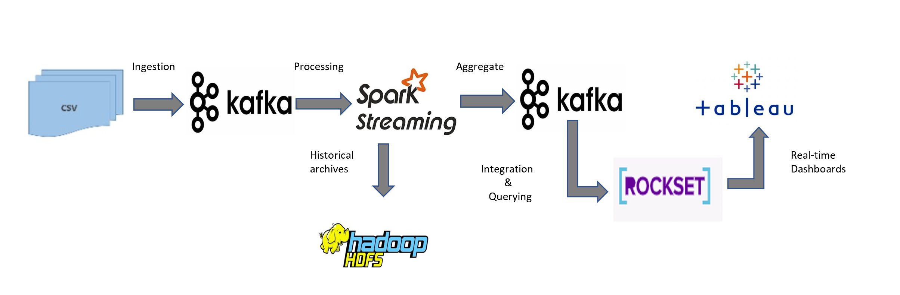
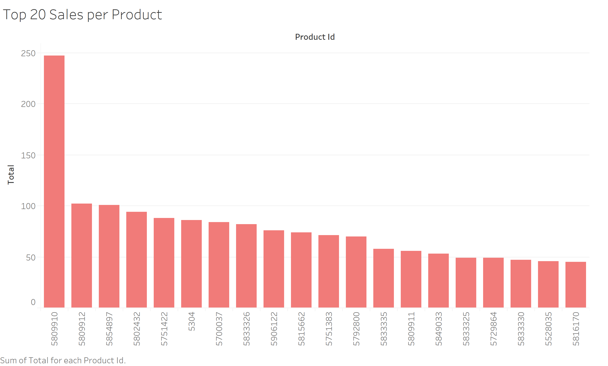

# **SalesInsights Data Pipeline**

## **Project Overview**

An e-commerce industry wants to gain real-time insights from the events log data to understand the sales and also want 
to store data on-premise in efficient manner for future batch processing and to build ML models. This project requires 
us to build a data pipeline that can serve business requirements.

## **Dataset**
This dataset consists of events data for 5 months (Oct 2019-Feb 2020) in .csv format from a medium cosmetics online store. You can find 
the dataset [here](https://www.kaggle.com/mkechinov/ecommerce-events-history-in-cosmetics-shop).  
It has following attributes
* event_time (in UTC)
* event_type
   * view
   * cart
   * removefromcart
   * purchase
* product_id
* category_id
* category_code
* brand
* price
* user_id
* user_session  

## **Business Logic**

1. visualize sales data per product within 30 to 45 seconds once the payment is done.
2. calculate customer lifetime value.

## **Data Pipeline**

## **Project Development**

#### **Data Ingestion**
* In this stage, stimulated real time scenario by split the dataset to each day and adding to input folder for ingestion each minute using scripts.
In real world we can have many input sources in different format with variable records/sec, I have taken one such case to develop the pipeline.
* Used ***File-pluse kafka connect*** to ingest the from input folder to kafka topic for each new file in the folder.
* To serialize the data, I have used ***JsonConverter***.  
***Note:*** We can also use ***Avro format*** to serialize our data, which supports schema evolution for changing dimensions.
Confluent kafka platform provides us with ***schema registry***, which helps in maintaining our schema with versions.

#### **Stream Processing**
* In this stage, Spark structured streaming was used to process the data
with necessary business logic transformations and filters.
* Used *watermark with stationary state* to get the business requirements.
* Archived processed data to on-prem cluster for batch processing and ML models.  
***Note:*** We can further use ***Arbitrary Stateful Processing*** for maintaining user sessions of an undetermined amount of time
and save those to perform some analysis on later to know abandonment cart after product was added to cart to increase sales.
Its only available in scala.
#### **Aggregation**
* Aggregated data with window and product_id from processing stage is pushed back to
kafka topic; to be consumed by various applications.

#### **Integration**
* Rocket, real-time analytics platform is used to *integrate kafka with tableau* for real-time insights and querying the data.
* Rocket stores the each record as a documents in collections and provides us with low latency aggregations and joins.

#### **Sales per Product Snapshot**

**Note:**
Main focus was understanding the tools and their integration to build pipeline for end requirement.
We can come up with many business requirements and anlysis with this use case.

## **References**

* [Team Data Science](https://www.teamdatascience.com/forum/community-blog-posts/building-data-pipeline-on-gcp-for-increasing-ecommerce-sales-conversion)
* [Structured streaming](https://databricks.com/blog/2017/04/26/processing-data-in-apache-kafka-with-structured-streaming-in-apache-spark-2-2.html)
* [streamthoughts File Pluse](https://streamthoughts.github.io/kafka-connect-file-pulse/docs/getting-started/)
* [Rockset Tableau with Kafka](https://rockset.com/blog/tableau-kafka-real-time-sql-dashboard-on-streaming-data/)
* [HDFS3 sink connector](https://docs.confluent.io/kafka-connect-hdfs3-sink/current/index.html)
 

